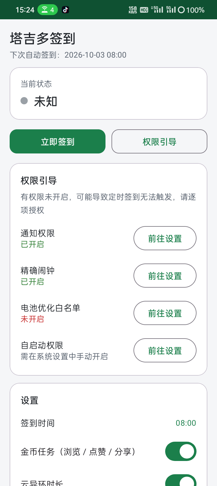
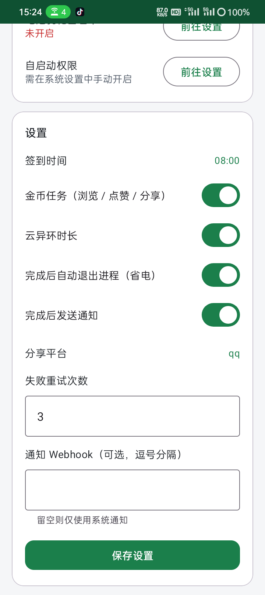
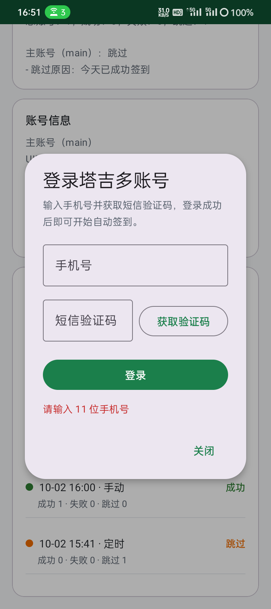

# 塔吉多自动签到（Android）

一个原生 Android 自动签到应用：每天定时自动完成 **APP 签到 + 游戏角色签到 + 金币任务 + 云异环时长领取**，完成后发送系统通知并自动退出进程省电。

> 本仓库中的 APK **不包含任何账号凭据**，安装后需自行配置账号（见 [账号配置](#账号配置重要)）。

---

## 功能特性

| 功能 | 说明 |
|---|---|
| 📱 验证码登录 | 应用内手机号 + 短信验证码登录，装上就能用自己的账号，无需命令行 |
| ⏰ 每日定时 | `AlarmManager` 精确闹钟，时间可在 App 内自定义（默认 08:00），开机后自动重排 |
| 🎮 完整签到 | APP 签到 + 3 个游戏角色签到 + 金币任务（签到/浏览/点赞/分享）+ 云异环时长 |
| 🔔 结果通知 | 签到结果系统通知，支持 Server 酱 / 自定义 Webhook |
| 🔋 省电自退 | 定时任务完成后自我了结进程并释放 WakeLock，避免后台耗电 |
| 🔐 权限引导 | 通知权限 / 精确闹钟 / 电池优化白名单 / 厂商自启动，一键跳转 |
| 📊 内置 UI | 签到状态、获得奖励、运行历史、签到时间等设置 |
| 🔁 会话保活 | accessToken → refreshToken → laohuToken → 密码登录 多级自动重建并回写 |

## 截图

| 概览与权限引导 | 设置 | 验证码登录 |
|---|---|---|
|  |  |  |

---

## 安装

下载 [dist/tajiduo-attendance-v1.1.1.apk](dist/tajiduo-attendance-v1.1.1.apk) 后：

```bash
adb install -r dist/tajiduo-attendance-v1.1.1.apk
```

或把 APK 传到手机点击安装。要求 **Android 8.0+**（minSdk 26），targetSdk 34。

安装后打开 App：

1. 在「账号信息」卡片点击 **「登录 / 添加账号」**，用手机号 + 短信验证码登录（见下）
2. 按「权限引导」卡片逐项授权

---

## 账号配置

仓库内的 APK 是**脱敏版**，不含任何账号凭据，安装后需登录你自己的账号。

### 方式一：应用内验证码登录（推荐）

打开 App，在「账号信息」卡片点击 **「登录 / 添加账号」**：

1. 输入手机号 → 点击「获取验证码」（60 秒后可重发）
2. 填入收到的短信验证码 → 点击「登录」

登录会自动完成整条链路：

```
短信验证码登录（老虎平台）→ 换取塔吉多会话 → 写入应用私有目录
```

成功后账号信息立即显示在卡片中，**无需任何命令行操作**。凭据仅保存在应用私有目录，卸载 App 即清除。支持多账号：再次登录会用新账号追加，同一账号登录则覆盖旧记录。

### 方式二：adb 注入（批量 / 离线场景）

debug 版 APK 支持 `run-as`，可免 root 注入现成的凭据文件：

```bash
# 1. 先打开 App 一次（让私有目录完成初始化），然后准备好 accounts.json
# 2. 推送到设备
adb push accounts.json /data/local/tmp/accounts.json

# 3. 复制到应用私有目录
adb shell run-as com.tajiduo.attendance cp /data/local/tmp/accounts.json files/accounts.json

# 4.（可选）如果需要密码兜底登录，再注入解密密钥
adb push credential-key /data/local/tmp/credential-key
adb shell run-as com.tajiduo.attendance cp /data/local/tmp/credential-key files/credential-key

# 5. 重启 App 生效
adb shell am force-stop com.tajiduo.attendance
```

### 方式三：自行构建

把真实的 `accounts.json`、`credential-key` 放入 `app/src/main/assets/` 后重新构建（见 [构建](#构建)）。
> 注意：请勿把含真实凭据的版本提交或分发。

### accounts.json 格式

```json
[
  {
    "id": "main",
    "name": "主账号",
    "uid": "你的用户ID",
    "deviceId": "设备标识",
    "accessToken": "访问令牌",
    "refreshToken": "刷新令牌",
    "openudid": "设备标识（H5 请求用）",
    "vendorid": "设备标识（H5 请求用）",
    "laohuToken": "老虎平台令牌（用于重建会话）",
    "laohuUserId": "老虎平台用户ID",
    "phone": "手机号（可选）",
    "roleId": "主角色ID（展示用）",
    "roleName": "主角色名（展示用）",
    "encryptedPassword": {
      "v": 2,
      "alg": "AES-256-GCM",
      "kdf": "scrypt",
      "salt": "base64url(salt)",
      "iv": "base64url(iv)",
      "tag": "base64url(tag)",
      "data": "base64url(密文)"
    }
  }
]
```

字段说明：

- `accessToken` / `refreshToken` — 主会话令牌，运行中会自动刷新并回写
- `laohuToken` / `laohuUserId` — 主令牌失效时用于重建会话
- `encryptedPassword` — 可选，最后兜底（用手机号 + 密码登录）；解密需配套的 `credential-key`
- 其余 `uid` / `deviceId` / `openudid` / `vendorid` 参与请求签名，必须与账号匹配

> 凭据可通过原有登录流程获取（`scrypt(N=16384,r=8,p=1,len=32)` 派生密钥 + `AES-256-GCM` 加密密码，`credential-key` 为派生口令）。

---

## 权限说明

| 权限 | 用途 |
|---|---|
| `INTERNET` | 调用签到接口 |
| `POST_NOTIFICATIONS` | 发送签到结果通知（Android 13+ 需动态申请） |
| `SCHEDULE_EXACT_ALARM` / `USE_EXACT_ALARM` | 精确到分的每日定时 |
| `RECEIVE_BOOT_COMPLETED` | 重启后重排闹钟 |
| `REQUEST_IGNORE_BATTERY_OPTIMIZATIONS` | 引导加入电池优化白名单 |
| `FOREGROUND_SERVICE(_DATA_SYNC)` / `WAKE_LOCK` | 签到期间前台服务与唤醒锁 |

**国内 ROM 必做**：在系统设置中为 App 开启「自启动」并加入「电池/后台运行白名单」，否则定时唤醒可能被系统拦截或延迟。

---

## 构建

环境要求：JDK 17、Android SDK（compileSdk 34）。

```bash
# Windows
gradlew.bat :app:assembleDebug

# macOS / Linux
./gradlew :app:assembleDebug
```

产物：`app/build/outputs/apk/debug/app-debug.apk`

> 若项目路径含非 ASCII 字符（中文目录），AGP 会拦截构建，已在 `gradle.properties` 中设置 `android.overridePathCheck=true`。

## 技术栈

- **语言/UI**：Kotlin + XML Views + Material Components
- **构建**：Gradle 8.7 + AGP 8.5.2 + Kotlin 1.9.24，minSdk 26 / targetSdk 34
- **网络**：OkHttp 4.12.0｜**并发**：kotlinx-coroutines
- **加密**：BouncyCastle（scrypt）、AES-128-ECB（签名）、AES-256-GCM（密码）

## 项目结构

```
app/src/main/java/com/tajiduo/attendance/
├── MainActivity.kt            # 首页 UI
├── HistoryAdapter.kt          # 运行历史列表
├── data/                      # 账号/状态/设置存储
├── net/                       # 协议、签名、加密、接口封装
├── login/                     # 短信验证码登录
├── runner/                    # 签到执行器（核心流程）
├── schedule/                  # 闹钟调度与开机重排
├── service/                   # 前台服务
├── notify/                    # 系统通知与 Webhook
└── permission/                # 权限引导
```

## 更新记录

### v1.1.1

- **更换应用图标**：使用《异环》角色壁纸作为图标，按 1:1 正方形构图以脸部为视觉中心裁切，保留发饰与爱心元素、裁掉文字 logo；生成全套自适应图标（adaptive icon）与各密度位图（mdpi~xxxhdpi），背景色取角色服装绯红 `#A22B3E`。

### v1.1.0

- **新增应用内验证码登录**：`MainActivity` 的「账号信息」卡片新增「登录 / 添加账号」按钮，手机号 + 短信验证码即可登录，无需 adb 注入凭据，任何人都能轻松上手。流程：`sendCaptcha` → `loginWithCaptcha` → `userCenterLogin` → 写入私有目录。
- 账号卡改为只展示已配置凭据的账号；未登录时给出引导文案，不再显示空模板。
- 支持多账号：新账号追加、同账号覆盖。

### v1.0.1

- **修复定时不准点**：改用 `setAlarmClock()`（系统唯一保证准点投递的接口，不受 Doze 与厂商电源策略窗口改写）。实测触发偏差由**分钟级降到毫秒级**（目标 16:30:00，实际 16:30:00.062）。
  副作用：状态栏会出现闹钟图标，点击可回到本应用。
- **修复定时运行后状态丢失**：`markSigned()` / `saveSummary()` / `lastRunDate` 由 `apply()`（异步刷盘）改为 `commit()`（同步落盘）。原实现中任务结束后会立即自杀进程，异步写入来不及刷盘就被丢弃，导致**去重键失效**、App 内结果展示陈旧。
- **修复 UI 数据源不一致**：结果卡改为优先读取 `runs.json` 最新记录（同步写入可靠），仅在历史缺失时回退 `last-summary`。
- **修复开机锁屏期不重排闹钟**：`BootReceiver` 增加 `android:directBootAware="true"`，`SettingsStore` 迁移到设备加密存储（direct boot），重启后未解锁也能读到签到时间。
- 新增关键路径日志（TAG: `TajiduoAttendance`），便于排障：闹钟排程/触发、服务启停、每账号结果、杀进程。

### v1.0.0

- 首个版本：定时签到、完整签到流程、结果通知、省电自退、权限引导、内置 UI。

## 已知限制

1. 使用 `setAlarmClock()` 会在**状态栏常驻闹钟图标**，这是为保证准点投递所做的取舍。
2. 国内 ROM 仍需手动开启「自启动」与「电池/后台运行白名单」，否则后台服务可能被拦截。

## 免责声明

本项目仅供个人学习与自动化实践使用。请自行评估账号与合规风险，**不要将包含凭据的 APK 分发给他人**，也不要将 `local-credentials/`、真实的 `assets/accounts.json`、`credential-key` 提交到任何仓库。